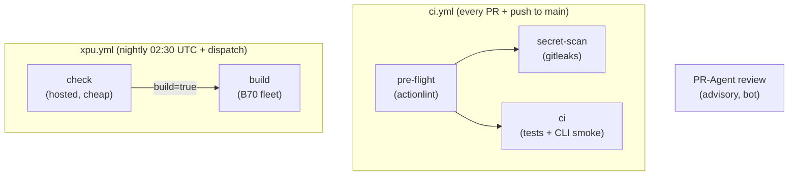

# CI

FreeToken-Intel has four checks. Three gate every PR to `main`
(`ci.yml`); one runs nightly on the B70 fleet (`xpu.yml`). An optional
bot review (`pr-review.yml`) runs in parallel and is advisory — it
never gates.

This page is the repo-side complement to the playbook's
`infrastructure/ci-platform.md`. If the two disagree, trust the
playbook page for org mechanics (runner fleet, variable wiring) and
this page for the repo's checks and the WHY behind each deviation
from it.

## Job map

| Check | Where | What it guards |
| --- | --- | --- |
| **pre-flight** | hosted | Workflow files parse and lint. Fails first, before any expensive job. |
| **secret-scan** | hosted | No secret enters the tree. **Hard-fails** on a finding. |
| **ci** | hosted | The CPU contract: torch-free venv, full CPU suite, live CLI smoke. |
| **xpu-nightly** | B70 fleet | The XPU half of the contract: torch present, `torch.xpu` alive, xpu-marked tests pass. |
| **PR-Agent review** | fleet | Advisory bot score + label. Not a gate. |

`pre-flight` has no `needs:` and runs first: a broken workflow file
fails fast and cheap instead of being discovered three jobs deep.
`secret-scan` and `ci` are independent of each other.

## Why these shapes

**Public repo ⇒ `ubuntu-latest` hardcoded.** A fork PR must never
execute on owned hardware. The org `CI_RUNNER` variable is a
private-org mechanism and does not apply to a public repo, so the
three `ci.yml` jobs pin `ubuntu-latest` directly. Consequently they
deliberately carry **no** `github.repository == ...` identity guard —
all their jobs run hosted, so there is nothing to guard. `xpu.yml` is
the opposite: its `build` job runs on the self-hosted B70 fleet, so
**every** job in that workflow carries the explicit
`github.repository == 'Performant-Labs/FreeToken-Intel'` guard. That
guard is the belt to the org-variable suspenders (a fork cannot see
the org variable, so its `runs-on` would be empty anyway); the pair
does not depend on the other, and the guard survives an org transfer.

**The XPU track is nightly-only.** Fork PRs get no per-PR access to
the fleet, so the torch/XPU path is verified on a `main`-only
schedule instead of on every push. The trade is explicit: per-PR CI
stays fork-safe and torch-free; the torch path is verified on a
trusted, scheduled runner. A broken torch path is therefore caught by
the nightly — up to 24 h after merge — not by the PR. That is the same
shape as upstream FreeToken's release-only CI (below).

**Gitleaks hard-fails here; the playbook warns.** The playbook runs
its scan warn-only because 21 repos carry untriaged historical
secrets. This repo has zero historical secret commits and is public,
so a warn-only period would be a standard nobody reads — the exact
failure mode the playbook's own doc warns about. Here, exit code 2
(leaks found) uploads the redacted report **and** fails the job. If
the playbook ever flips this repo onto warn-only, this paragraph
explains the trade.

**Python 3.11, not 3.12.** Both dev venvs (`.venv` and `.venv-xpu`)
are 3.11. The CPU CI venv must match the XPU venv's minor so their
wheel tags (cp311) stay aligned; a CPU venv on a different minor is a
silent divergence trap.

**No no-op fallback on the XPU runner.** `xpu.yml` uses
`runs-on: ${{ vars.CI_RUNNER }}` with **no** `|| 'ubuntu-latest'`.
The playbook's original `||` was a bug it has since retired: a repo
that couldn't see the org variable silently ran hosted and stayed
green, invisibly (15 of 21 repos were doing exactly that). Here, a
missing or stale variable yields an empty `runs-on` and the job fails
immediately — drift announces itself instead of being found months
later. The check job (below) also fails the build if the runner is
re-pointed at a box with no XPU.

## The dual-venv contract

The load-bearing separation in this repo: `.venv` (CPU) must **never**
contain torch; torch (the XPU build) lives **only** in `.venv-xpu`.
The whole CUDA→SYCL premise rests on the CPU side never importing a
CUDA/CPU torch. Two CI guards enforce the two halves, and a violation
of either is a **contract breach, not a flake**:

* `ci.yml` → `ci` job → *"venv contract: torch must NOT be
  importable"*: fails if `import torch` **succeeds** in the CPU venv.
* `ci.yml` → `ci` job → *CLI smoke*: asserts `ft device` reports
  `xpu available: False` on the GPU-less hosted runner. A hosted
  runner that reports an XPU as available is fleet misconfiguration —
  the assertion lets it fail loudly instead of `|| true`-ing away.
  (The assertion reads a `tee`'d file with a pipe-free `grep`, not the
  pipeline, to avoid the `pipefail`/`grep -q`/SIGPIPE false-negative —
  see `tools/validate.sh` notes.)
* `xpu.yml` → `build` job → *"venv contract: .venv-xpu …"*: the other
  half — the venv where torch **is** required and `torch.xpu.is_available()`
  must be True.

## The SYCL conformance rule

(Tracked in [#46]; the job is not yet in `ci.yml` — see the
"pending" note below.) Every file under `kernel/csrc/` that
`#include <sycl/sycl.hpp>` must also use the `sycl_ext::` extension
namespace (e.g. `sycl_ext::make_kernel`), per the "never compile
against a fake SYCL" rule. A file that legitimately uses only the
standard SYCL API is listed in an explicit allowlist; a new file that
includes the SYCL header, uses no `sycl_ext::`, and is not
allowlisted **fails** the check and names the file. This is the drift
the rule exists to prevent: a "portable SYCL" kernel that silently
stops binding the XPU extensions. To add a legitimately-standard-SYCL
file: add it to the allowlist (`.github/ci-conformance-allowlist` or
the job-local named section — the implementation will document which) and the
check greps for `#include <sycl/sycl.hpp>` vs a `sycl_ext::`
reference in the same file.

> **Pending:** the `conformance` job is not yet wired into `ci.yml`
> (see issue #46). Until it lands, the no-CUDA and version-singularity
> invariants described in #46 are not yet enforced in CI.

## CTRF artifacts

Both `ci.yml` (CPU) and `xpu.yml` (XPU) upload a CTRF JSON test
report as a workflow artifact (`ctrf-reports` / `xpu-ctrf-<run>-<attempt>`),
30-day retention. There is **no PR check-run summary** for CTRF
(playbook parity): reading it today means downloading the artifact
from the run. The CTRF upload is the **only** `continue-on-error` in
either workflow, and it runs `if: always()` — an upload failure
(network blip) must never turn a red or green test run into a
confusing third state, and a failing run is exactly when the report is
most needed.

## XPU nightly operations

* **Runner label:** `CI_RUNNER` (org variable, resolves to the
  self-hosted B70 fleet — e.g. `jupiter-b70`). No fallback.
* **Stamp-skip (idempotency):** a cheap hosted `check` job compares
  `GITHUB_SHA` against the last **green** `xpu-nightly` run on the
  branch (via the GitHub API). Equal → `build=false` and the fleet job
  is skipped with a visible "already green at this commit" notice. A
  no-op night must not touch the B70. A `workflow_dispatch` with
  `force: true` bypasses the check. Runs are serialized per-branch
  (`concurrency`, no cancel-in-progress) so two runs never share the
  one GPU runner.
* **Is the GPU actually there (2-min diagnostic):** the `build` job's
  first step primes oneAPI (`setvars-xpu.sh`) and then runs `sycl-ls`.
  If `sycl-ls` is missing → oneAPI absent from the image; if it runs
  but finds no Level Zero device → the GPU ICD is not loaded. Both
  fail loudly and early, in the step whose name says what happened.
* **When it goes red:** distinguish **toolchain drift** (oneAPI/venv
  drift — re-bake the runner image, re-run `docs/dev-setup.md`) from a
  **real regression** (a test that used to pass now fails on the B70).
  The CTRF artifact tells you which tests failed; the `sycl-ls` output
  in the run log tells you whether the GPU was even present.

## Upstream comparison (vs FlashML-org/FreeToken)

We are porting FlashML's FreeToken. Upstream has **no PR-gated CI at
all** — its workflows are two publishing pipelines (nightly wheels,
tag release) plus Copilot review. Merges to `main` run no tests, no
lint, no secret scan; a broken `main` is caught by the nightly, i.e.
up to 24 h after merge. Our shape gates **per-PR**; they gate
**per-release**. Four of upstream's release-ops practices are strictly
better, so we borrowed them:

| # | Upstream practice | Where it landed here |
| --- | --- | --- |
| 1 | SHA-stamp idempotency (skip a no-op nightly before touching the build node) | `xpu.yml` `check` job (above) |
| 2 | Build/publish split with credential quarantine (build on self-hosted, publish from a hosted runner behind an `environment:` reviewer gate; the cross-repo token is never present on the build node) | Governing principle recorded for #31's future wheel work: **Uranus builds, GitHub-hosted publishes, behind an `environment:` reviewer gate, with tools run via `pipx run` / a fresh venv** |
| 3 | Fork-proofing (repo-identity guard on every self-hosted job) | `xpu.yml` guards every job; `ci.yml` comments explain why it needs none |
| 4 | Pin everything (actions to full SHAs; publish tools via `pipx run`) | All `uses:` in both workflows are SHA-pinned with a `# vN` comment (below) |

## Rules

* **Pin actions deliberately.** Every `uses:` in `ci.yml` and
  `xpu.yml` is pinned to a full commit SHA (not a floating tag) with a
  trailing `# vN` comment naming the release the SHA is. Bump pins
  **deliberately, one PR per action, never implicitly** — an unpinned
  tag is the same failure class as the playbook's retired
  `CI_RUNNER || 'ubuntu-latest'` bug: a silent, invisible behavior
  change (a new action release could change checkout or upload
  semantics under a green-looking run).
* **No mutable interpreters in publish-shaped steps.** Any step that
  touches artifacts or credentials installs its tooling into the job's
  own fresh venv (or runs it via `pipx run`); it never relies on a
  pre-installed interpreter on the runner image. This is upstream's
  `pipx run twine` rule, inherited by #31's wheel workflows so a
  compromised or drifted runner can't substitute a trojaned installed
  copy.

## Related

* Machine-side story (two venvs, driver, oneAPI, local pre-flight):
  [docs/dev-setup.md](dev-setup.md)
* Org-side story (runner fleet, `CI_RUNNER`, variable wiring):
  playbook `infrastructure/ci-platform.md`
* Local mirror of the CI gates (run `tools/validate.sh` before
  pushing): [tools/validate.sh](../tools/validate.sh)
